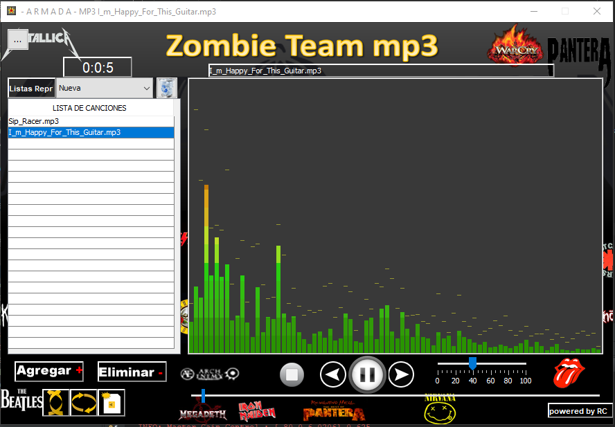

# ReproductorMP3-Java-Swing

  

## Reproductor de MP3 en Java 8 Proyecto de Clase.

Funciones:

* Arrastrar para agregar canciones
* Subir/Bajar Volumen
* Adelantar/Retrasar Sonido
* Guardar Listas de Reproduccción.
